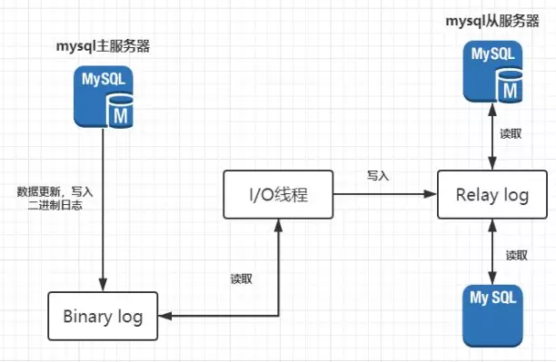
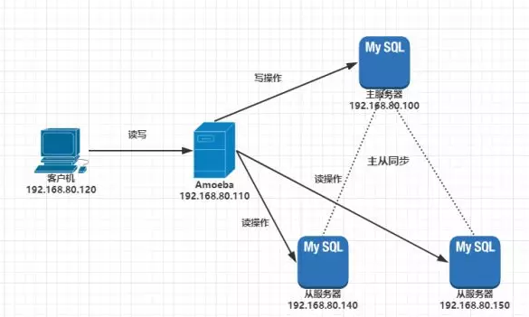

+ **Mysql主从复制(master-slave)和读写分离(Mysql-Proxy)**

**主从复制**：主库将变更把变更写入binlog日志，从库开一个IO线程，将主库的binlog日志拷贝到自己本地，写入一个relay中继日志中。接着从库中有一个sql线程从中继日志中读取binlog，然后执行binlog日志的内容，再自己本地再执行一遍SQL操作，保证自己跟主库的数据一样的。

半同步复制：主库写入 binlog 日志之后，就会将强制此时立即将数据同步到从库，从库将日志写入自己本地的 relay log 之后，接着会返回一个 ack 给主库，主库接收到至少一个从库的 ack 之后才会认为写操作完成了。防止主库宕机，数据还没有保存

并行复制：从库开启多个线程，并行的读取relay log中不同库的日志，然后并行重放不同库的日志

**读写分离**：读写分离就是只在主服务器上写，只在从服务器上读，让主数据库处理事务性的查询，而从服务器处理select查询。数据库的复制就用来把事务性查询导致的变更同步到从数据库中

+ **一致性hash**

用于负载均衡的一个手段，将整个hash空间组织成一个虚拟的圆环,可以根据服务器的IP或主机名作为关键字做hash，这样每台机器就能确定在hash环上的位置

定位数据访问到对应服务器的方法：根据数据key使用相同的hash计算出哈希值，并确定此数据在环上的位置，从此位置沿环顺时针行走，第一台遇到的服务器就是其应该定位到的服务器

+ **秒杀系统如何设计**

