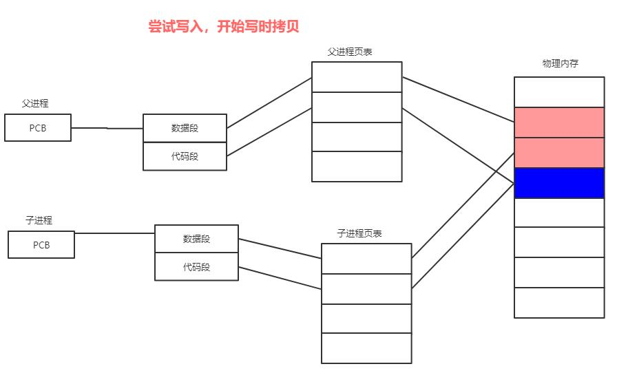

+   **磁盘存储查询、内存使用查询**

    **磁盘存储查询**：df -k 以KB为单位显示磁盘使用率和占用量
    
    
    

    **内存使用查询**：使用top命令

    

    |变量|含义|
    | :-: | :-: |
    |PID|当前运行进程的ID|
    |USER|进程属主|
    |PR|每个进程的优先级别|
    |NI|反应一个进程“优先级”状态的值，这个值越小，表示进程”优先级”越高，而值越大“优先级”越低|
    |VIRT|进程占用的虚拟存储|
    |RES|进程占用的物理存储|
    |SHR|进程使用的共享内存|
    |S|进程的状态，S表示休眠，R表示正在运行，Z表示僵死|
    |%CPU|进程CPU的占用率|
    |%MEM|进程使用的物理内存和总内存的比|
    |TIME+|进程启动后占用的总的CPU时间|
    |COMMAND|进程的命令名称|

+   **PS命令**

    PS -aux 表示按照 CPU 或者内存用量来筛选

+   **僵尸进程，孤儿进程**

    僵尸进程:在每个进程退出时，内核释放该进程所有的资源，包括打开的文件，占用的内存。但是仍要保存一些信息（如Pid）。这些保留的信息直到进程通过调用wait/waitpid时才释放，这些还没有经wait/waitpid调用的进程就叫做僵尸进程。

    既子进程先结束而父进程后结束，但是子进程结束后，父进程还在运行但是没有调用wait/waitpid那子进程就会成为僵尸进程

    如果是父进程先结束，但是子进程没有结束，子进程会交由init接管，不会产生僵尸进程

    僵尸进程的解决办法：
    -   调用wait或者waitpid函数
    -   fork两次，父进程fork子进程后继续执行，子进程fork一个孙进程后退出，此时孙进程会被init进程接管，避免僵尸进程，当然子进程的退出还是要进行处理的;
    -   使用信号函数sigaction为SIGCHLD设置wait处理函数。这样子进程结束后，父进程就会收到子进程结束的信号。并调用wait回收子进程的资源

+   **fork和vfork的用法**

    先分别介绍一下fork和vfork

    **fork**: 1.    是Unix下以自身进程创建子进程的系统调用，一次调用，两次返回，如果返回是0，则是子进程，如果返回值>0，则是父进程（返回值是子进程的pid; 2.  在fork()的调用处，整个父进程空间会原模原样地复制到子进程中，包括指令，变量值，程序调用栈，环境变量，缓冲区，等等。fork调用的时候也会存在写时复制的问题，刚开始的时候都是共享一块内存，如下图所示

    

    但是当任意的一方要需要写数据的时候，才会拷贝额外的空间，如下所示
    

    
    
    **vfork**: 也是创建一个子进程，但是它是和父进程内存数据是共享的,子进程会先运行，父进程会被挂起，知道子进程调用exec或exit。vfork()跟fork()类似，都是创建一个子进程，这两个函数的的返回值也具有相同的含义。但是vfork()创建的子进程基本上只能做一件事，那就是立即调用_exit()函数或者exec函数族成员，调用任何其它函数（包括exit()）、修改任何数据（除了保存vfork()返回值的那个变量）、执行任何其它语句（包括return）都是不应该的。更需要注意的是：调用vfork()之后，父进程会一直阻塞，直到子进程调用_exit()终止，或者调用exec函数族成员。

    

    **fork和vfork的区别**：

    -   vfork保证子进程先运行，在它调用exec或exit之后父进程才可能被调度运行。如果在调用这两个函数之前子进程依赖于父进程的进一步动作，则会导致死锁。
    -   fork要拷贝父进程的进程环境；而vfork则不需要完全拷贝父进程的进程环境，在子进程没有调用exec和exit之前，子进程与父进程共享进程环境，相当于线程的概念，此时父进程阻塞等待。

+   **select poll epoll 区别以及各自的应用场景**

+   **Linux中读取文件的常规操作**

    1)  进程发起读文件请求
    2)  **内核**通过查找进程文件符表，定位到内核已打开文件集上的文件信息，从而找到此文件的inode。
    3)  inode在地址空间上查找要请求的文件页是否已经缓存在页缓存中。如果存在，则直接返回这片文件页的内容。
    4） 如果不存在，则通过inode定位到文件磁盘地址，将数据从磁盘复制到页缓存。之后再次发起读页面过程，进而将页缓存中的数据发给用户进程。

+   **mmap**

    mmap是一种内存映射文件的方法，将一个文件或其它对象映射到进程的地址空间，实现**文件磁盘地址**和**进程虚拟地址空间**中一段虚拟地址的一一对应关系。实现这样的映射的关系后，进程可以采用指针的方式读写这一段内存，而系统会自动回写脏页面到对应的磁盘空间，即完成了对文件的操作不必再调用read，write等系统调用函数。

    

+   **Linux的inode**

    文件存储在硬盘上，硬盘的最小存储单位叫做“扇区”（Sector）。每个扇区储存512字节（相当于0.5KB),操作系统一次性读取硬盘的时候，一次性连续读取多个扇区，即一次性读取一个“块”。文件数据都存在块中，需要一个地方来存储文件的“元信息”，比如文件的创建者，文件的创建日期，文件的大小等，这种存储文件“元信息”的区域就叫做inode
