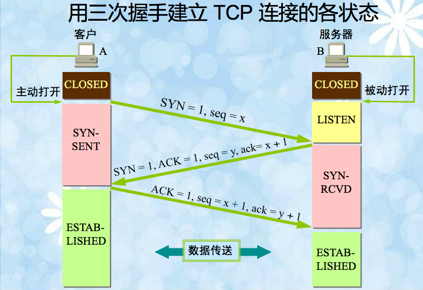
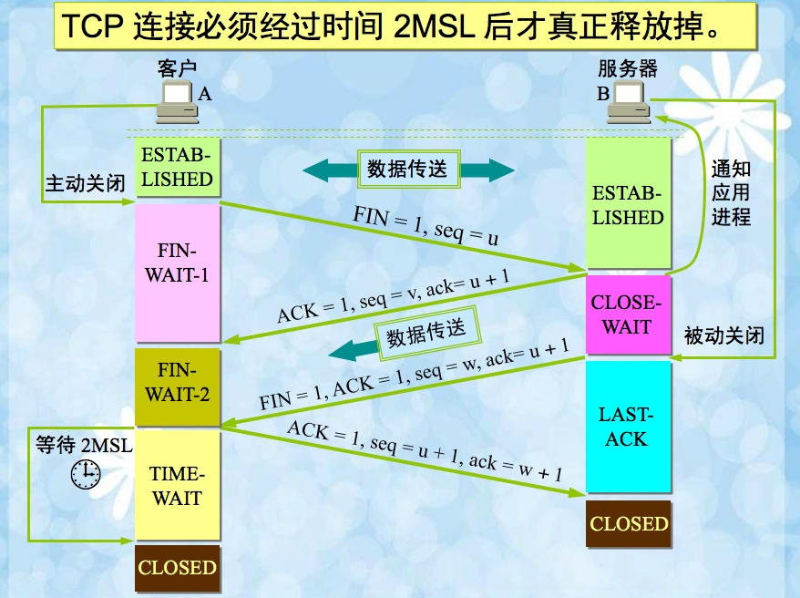
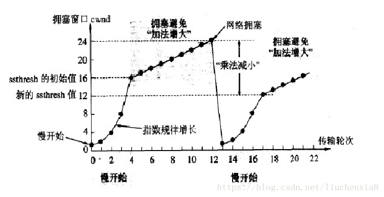

+   **五层网络模型介绍一下，同时介绍一下每一层有哪些协议**

    有个不错的网址可以参考一下https://wizardforcel.gitbooks.io/network-basic
    
    
    |OSI层|功能|协议|
    | :-: |:- | :- |
    |应用层|文件传输，电子邮件，文件服务，虚拟终端|HTTP,FTP,SMTP,DNS|
    |表示层|数据格式化，代码转换，数据加密|\|
    |会话层|解除或建立与其它节点的联系|\|
    |传输层|提供端到端的接口|TCP,UDP|
    |网络层|为数据包选择路由|IP,ICMP,BGP,IGMP|
    |数据链路层|传输有地址的帧，错误检测功能|SLIP,ARP|
    |物理层|以二进制数据形式在物理媒体上传输数据|ISO2110|

    ICMP:网络控制消息协议，主要用于传递查询报文与差错报文

    ARP:地址解析协议，它的作用是在以太网环境下，通过3层的IP地址来找寻2层的MAC地址，得到一张ARP缓存表。转发数据的时候根据ARP缓存表来进行传输。

+   **TCP三次握手和四次挥手**

    **TCP的三次握手**：Client端发送连接请求报文，Server段接受连接后回复ACK报文，并为这次连接分配资源。Client端接收到ACK报文后也向Server段发送报文，并分配资源，这样TCP连接就建立了。
    
    
    
    **TCP的四次挥手**：Client端发起中断请求，也就是发送FIN报文。Server端接到FIN报文后，意思是说“我client端要发给你了”，但是如果你还没有数据要发送完成，则不必急着关闭Socket，可以继续发送数据。所以所以你先发送ACK，"告诉Client端，你的请求我收到了，但是我还没准备好，请继续你等我的消息"。这个时候Client端就进入FIN_WAIT状态，继续等待Server端的FIN报文。当Server端确定数据已发送完成，则向Client端发送FIN报文，"告诉Client端，好了，我这边数据发完了，准备好关闭连接了"。Client端收到FIN报文后，"就知道可以关闭连接了，但是他还是不相信网络，怕Server端不知道要关闭，所以发送ACK后进入TIME_WAIT状态，如果Server端没有收到ACK则可以重传。“，Server端收到ACK后，"就知道可以断开连接了"。Client端等待了2MSL后依然没有收到回复，则证明Server端已正常关闭，那好，我Client端也可以关闭连接了。

    

+   **TCP为什么是三次握手和四次挥手**

    这是因为服务端在LISTEN状态下，收到建立连接请求的SYN报文后，把ACK和SYN放在一个报文里发送给客户端。而关闭连接时，当收到对方的FIN报文时，仅仅表示对方不再发送数据了但是还能接收数据，己方也未必全部数据都发送给对方了，所以己方可以立即close，也可以发送一些数据给对方后，再发送FIN报文给对方来表示同意现在关闭连接，因此，己方ACK和FIN一般都会分开发送。

+   **TCP粘包**

+   **TCP和UDP的区别**

    |TCP|UDP|
    | :-: | :-: |
    |面向连接|面向无连接|
    |面向字节流|基于数据报|
    |保证数据正确性|可能丢包|
    |保证数据顺序|不保证数据有序|

+   **TCP怎么保证可靠传输的**

    TCP协议保证数据传输可靠性的方式主要有：
    -   校验和
    -   序列号
    -   确认答应
    -   超时重传
    -   连接管理
    -   流量控制
    -   拥塞控制

    **校验和**：在数据传输的过程中，将发送的数据段都当做一个16位的整数。将这些整数加起来。并且前面的进位不能丢弃，补在后面，最后取反，得到校验和。 发送方在发送数据之前计算检验和，并进行校验和的填充。 接收方收到数据后，对数据以同样的方式进行计算，求出校验和，与发送方的进行比对。

    **确认应答与序列号**：序列号是指TCP传输时将每个字节的数据都进行了编号，确认应答，TCP传输的过程中，每次接收方收到数据后，都会对传输方进行确认应答。也就是发送ACK报文。这个ACK报文当中带有对应的确认序列号，告诉发送方，接收到了哪些数据，下一次的数据从哪里发。

    **超时重传**：发送方没有接受到响应的ACK报文的原因可能有两个点：1.数据在传输过程中由于网络原因等直接全体丢包，接收方根本没有接收到；2.接收方接收到了响应的数据，但是发送的ACK报文响应却由于网络原因丢包了。发送方在发送完数据后等待一个时间，时间到达没有接收到ACK报文，那么对刚才发送的数据进行重新发送。如果是刚才第一个原因，接收方收到二次重发的数据后，便进行ACK应答。如果是第二个原因，接收方发现接收的数据已存在（判断存在的根据就是序列号，所以上面说序列号还有去除重复数据的作用），那么直接丢弃，仍旧发送ACK应答。

    **连接管理**：指三次握手和四次挥手

    **流量控制**：接收端在接收到数据后，对其进行处理。如果发送端的发送速度太快，导致接收端的结束缓冲区很快的填充满了。此时如果发送端仍旧发送数据，那么接下来发送的数据都会丢包，继而导致丢包的一系列连锁反应，超时重传呀什么的。**TCP根据接收端对数据的处理能力，决定发送端的发送速度，这个机制就是流量控制**。
    在TCP协议的报头信息当中，有一个16位字段的窗口大小。在介绍这个窗口大小时我们知道，窗口大小的内容实际上是接收端接收数据缓冲区的剩余大小。这个数字越大，证明接收端接收缓冲区的剩余空间越大，网络的吞吐量越大。接收端会在确认应答发送ACK报文时，将自己的即时窗口大小填入，并跟随ACK报文一起发送过去。而发送方根据ACK报文里的窗口大小的值的改变进而改变自己的发送速度。如果接收到窗口大小的值为0，那么发送方将停止发送数据。并定期的向接收端发送窗口探测数据段，让接收端把窗口大小告诉发送端。

    **拥塞控制**：TCP传输的过程中，发送端开始发送数据的时候，如果刚开始就发送大量的数据，那么就可能造成一些问题。网络可能在开始的时候就很拥堵，如果给网络中在扔出大量数据，那么这个拥堵就会加剧。拥堵的加剧就会产生大量的丢包，就对大量的超时重传，严重影响传输。

    所以TCP引入了慢启动的机制，在开始发送数据时，先发送少量的数据探路。探清当前的网络状态如何，再决定多大的速度进行传输。这时候就引入一个叫做拥塞窗口的概念。发送刚开始定义拥塞窗口为 1，每次收到ACK应答，拥塞窗口加 1。在发送数据之前，首先将拥塞窗口与接收端反馈的窗口大小比对，取较小的值作为实际发送的窗口。

    拥塞窗口的增长是指数级别的。慢启动的机制只是说明在开始的时候发送的少，发送的慢，但是增长的速度是非常快的。为了控制拥塞窗口的增长，不能使拥塞窗口单纯的加倍，设置一个拥塞窗口的阈值，当拥塞窗口大小超过阈值时，不能再按照指数来增长，而是线性的增长。在慢启动开始的时候，慢启动的阈值等于窗口的最大值，一旦造成网络拥塞，发生超时重传时，慢启动的阈值会为原来的一半（这里的原来指的是发生网络拥塞时拥塞窗口的大小），同时拥塞窗口重置为 1。 

    

+   **TCP数据传输过程中如何确认数据包未发送成功？有什么机制？（todo）**

+   **长连接和短连接？**

    短连接：每进行一个HTTP操作就建立一次连接，任务结束中断连接。当客户端访问HTML或其它类型的Web页中包含其它Web资源，每遇到一个Web资源，就重新建立一个连接

    长连接：当打开一个网页时，客户端和服务器之间用于传输HTTP数据和TCP连接不会关闭，它会保持一段时间

    HTTP协议的长连接和短连接，实质上是TCP协议的长连接和短连接

    TCP短连接：短连接一般只会在 client/server间传递一次请求操作

    TCP长连接：client向server发起连接，server接受client连接，双方建立连接，client与server完成一次请求后，它们之间的连接并不会主动关闭，后续的读写操作会继续使用这个连接。TCP的保活功能主要为服务器应用提供。如果客户端已经消失而连接未断开，则会使得服务器上保留一个半开放的连接，而服务器又在等待来自客户端的数据，此时服务器将永远等待客户端的数据。保活功能就是试图在服务端器端检测到这种半开放的连接

    |连接类型 &nbsp;|优点|缺点|
    | :- | :-: |:-: |
    |短连接|管理起来比较简单，存在的连接都是有用的连接，不需要额外的控制手段|在TCP的建立和关闭操作上浪费较多时间和带宽。|
    |长连接|长连接可以省去较多的TCP建立和关闭的操作，减少浪费，节约时间|需要处理的状态更多，连接过多但是又没有请求数据，对服务端的压力会比较大|

    短连接应用场景：WEB网站的http服务一般都用短链接，因为长连接对于服务端来说会耗费一定的资源，而像WEB网站这么频繁的成千上万甚至上亿客户端的连接用短连接会更省一些资源，如果用长连接，而且同时有成千上万的用户，如果每个用户都占用一个连接的话，那可想而知吧。所以并发量大，但每个用户无需频繁操作情况下需用短连好。

    长连接应用场景：长连接多用于操作频繁，点对点的通讯，而且连接数不能太多情况，。每个TCP连接都需要三步握手，这需要时间，如果每个操作都是先连接，再操作的话那么处理速度会降低很多，所以每个操作完后都不断开，次处理时直接发送数据包就OK了，不用建立TCP连接。例如：数据库的连接用长连接， 如果用短连接频繁的通信会造成socket错误，而且频繁的socket 创建也是对资源的浪费。

+   **TIME_WAIT状态的作用，时长为什么是2MSL**

    为了保证客户端发送的最后一个ACK报文段能够到达服务器。这个ACK报文段可能丢失，因而使在Last-ACK状态的服务器收不到对已发送的FIN+ACK报文段的确认。服务器就会超时重传这个报文段，而客户端就能在2MSL时间内收到这个重传的FIN-ACK报文段。接着客户端重传一个确认，重新启动2MSL计时器。最后客户端和服务器端都能正常进入到CLOSED状态。如果服务器端在TIME-WAIT状态下不等待一段时间，而是在发送完ACK报文段就立即释放连接，那么客户端就无法收到服务器重传的FIN_ACK报文段，因而也就不会再发送一个报文段，这样服务器就无法进入CLOSED状态。

+   **服务器中大量TIME_WAIT怎么解决**

+   **https和连接建立过程**

+   **输入一个淘宝网址的发生过程**

+   **HTTP和HTTPS区别**
